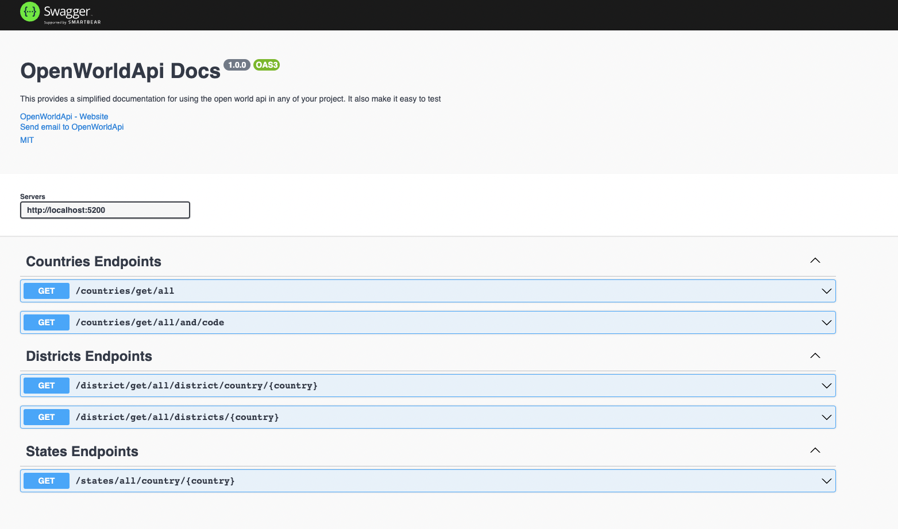

# **Open World API**

Find the way to get informations about countries such as countries, cities, states, districts, currency and many more from the documentation below

<a>

## **URLS**

- **url** = <http://localhost:5000/> -> Is the url used when in development
- **url** = <https://openworldapi.gdsclpu.live/> -> Is the url used when in production
  

<!-- # *Cities*
- GET -> <**url**>/cities/get/all/cities/country/:country?reverse=false
  - Description: For getting all cities in a country
  - :country = **name of country** -> ***REQUIRED***
  - reverse = **Sorting output** -> ***OPTIONAL***
- GET -> <**url**>/cities/get/all/cities/state/:country?reverse=false&state
  - Description: For getting all cities in a particular state of a country
  - :country = **name of country** -> ***REQUIRED***
  - state = **Name of state in a country** -> ***REQUIRED***
  - reverse = **Sorting output** -> ***OPTIONAL*** -->
  

### GDCSLPU

